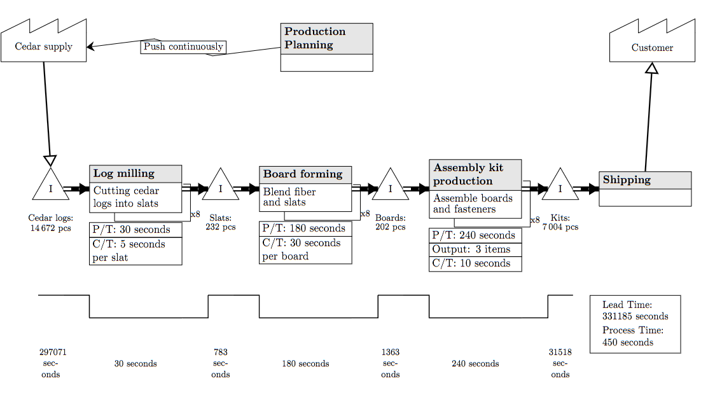
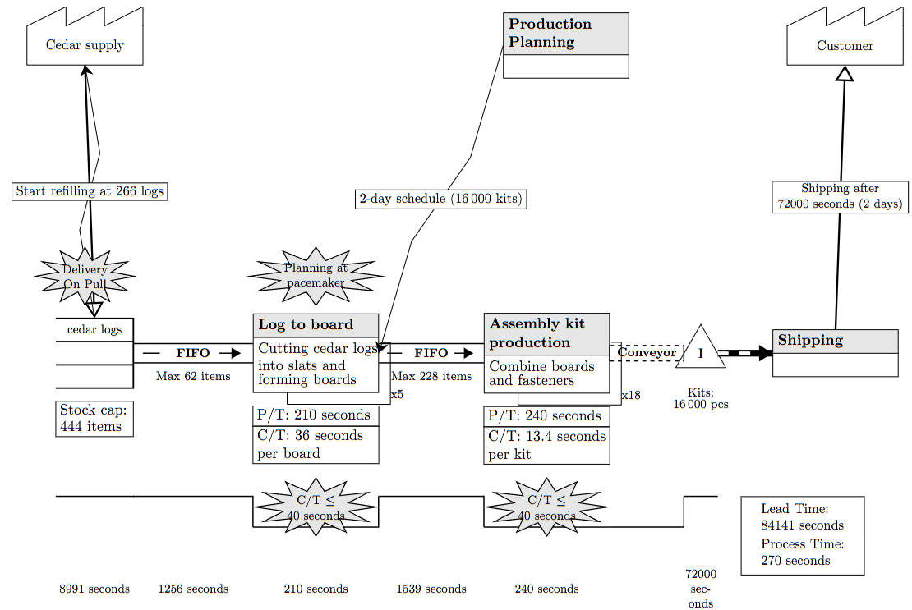

# Value stream mapping LaTeX helpers

This repository contains a small TikZ-based LaTeX package for drawing value stream mapping (VSM) symbols and arrows in a clean, reusable way.

The commands were originally inspired by a Stack Exchange answer by Christian (https://tex.stackexchange.com/a/250523), and then extended substantially for use in production-oriented value stream maps.

## Usage

The package is intended to be used as a standard LaTeX style file. Include it in your document with `\usepackage{vsm-commands}` and then call the VSM commands from within a `tikzpicture` environment. This makes it easy to assemble a value stream map in the same way you would build any other diagram: place nodes, connect them with arrows, and add labels where needed.

Typical usage is:

```tex
\documentclass[11pt]{article}
\usepackage{tikz}
\usepackage{graphicx}
\usepackage{vsm-commands}

\begin{document}
\begin{tikzpicture}[font=\small]
  \vsmIndustry[Customer]{0,5}
  \vsmInventory[Raw material]{1,0}{Steel\\500 pcs}
  \vsmProcess[Cutting]{4,0}{Cutting}{Remove burrs}[][2]
  \vsmDeliveryArrow{Raw material.east}{Cutting.west}
\end{tikzpicture}
\end{document}
```

This pattern allows you to create full VSM pages with consistent symbol styling, while still taking advantage of standard TikZ positioning, coordinate anchors, and drawing control.

## Quick start

Place `vsm-commands.sty` in the same directory as your main LaTeX file, then load it:

```tex
\documentclass[11pt]{article}
\usepackage{tikz}
\usepackage{graphicx}
\usepackage{vsm-commands}

\begin{document}
\begin{tikzpicture}[font=\small]
  \vsmIndustry[Customer]{0,5}
  \vsmInventory[Buffer]{1,0}{Raw material\\500 pcs}
  \vsmProcess[Cutting]{4,0}{Cutting}{Trim to spec}[][2]
\end{tikzpicture}
\end{document}
```

Compile with:

```bash
pdflatex main.tex
```

or, if you prefer:

```bash
latexmk -pdf main.tex
```

## Available commands

- `\vsmIndustry[<node name>]{<position>}`
- `\vsmInventory[<node name>]{<position>}{<label text>}`
- `\vsmSupermarket[<node name>]{<position>}{<name text>}`
- `\vsmDataBox[<node name>]{<position or parent node>}{<row 1>|<row 2>|...}`
- `\vsmProcess[<node name>]{<position>}{<title>}{<description>}[<worker count>][<parallel count>]`
- `\vsmLeadTimeLadder[<totals box node name>]{<type>/<linked node>/<time>,...}{<lead time total>}{<process time total>}`
- `\vsmWorkcell[<node name>]{<position>}{<label text>}`
- `\vsmDeliveryArrow[<draw options>][<textbox text>]{<from>}{<to>}`
- `\vsmManualInformationFlow[<draw options>]{<from>}{<to>}`
- `\vsmElectronicInformationFlow[<draw options>][<textbox text>]{<from>}{<to>}`
- `\vsmPushArrow[<draw options>][<textbox text>]{<from>}{<to>}`
- `\vsmFIFOArrow[<node name>][<draw options>]{<from>}{<to>}{<max cap count>}`
- `\vsmConveyor[<node name>][<draw options>]{<from>}{<to>}`
- `\vsmKaizenBurst[<node name>]{<position>}{<text line 1>\\<text line 2>}`

## Example outputs

The images below were created with this library. They show the kind of value stream maps and VSM symbol collections the package can generate when used in a LaTeX document.

### Current-state value stream example



This example shows a current-state VSM with supplier, inventory, process steps, queueing, and delivery flow.

### Future-state value stream example



This example shows a future-state map with a streamlined flow and lead-time ladder.

## Notes

- For process counts, use the optional worker count and parallel count arguments only when needed.
- Use `\\` inside label text to create multi-line labels without adding extra rows in the data box.
- The package expects TikZ and the standard LaTeX graphics stack to be available.
- The repository also contains example source files in `main.tex`, `example-current-value-stream.tex`, and `example-future-value-stream.tex`.

The sample diagrams in this repository are generated from the library itself and are intended as ready-to-use examples for VSM documentation and reporting.

## License and usage terms

This project is distributed under the MIT license and can be founder under `LICENSE`.
